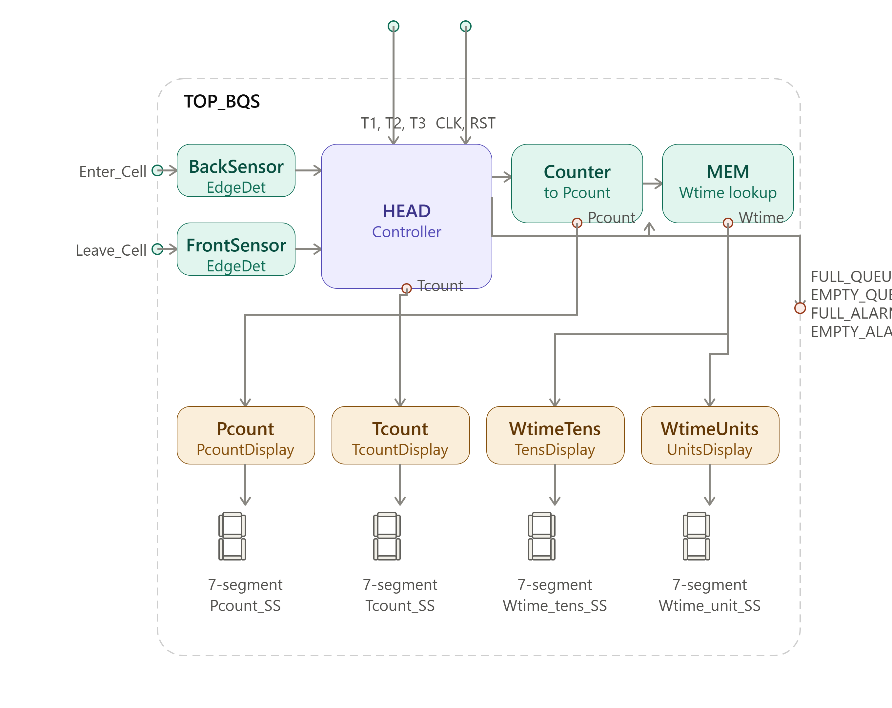
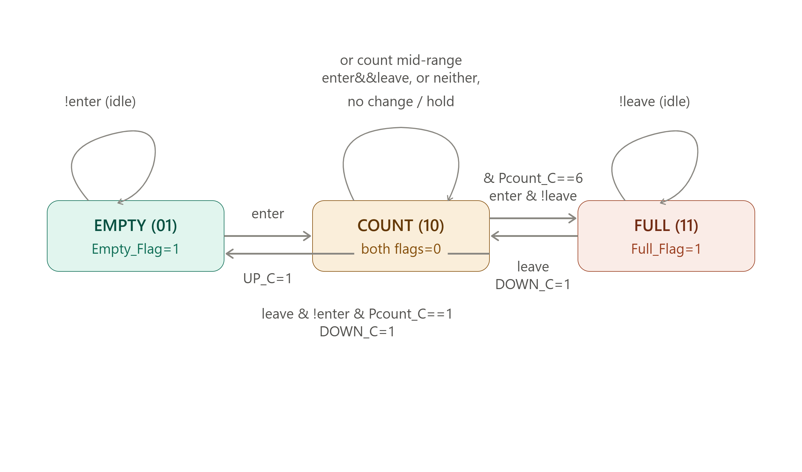

# ITI Bank Queuing System (ITI_BQS)

## Overview

ITI_BQS is a Verilog-based digital system designed to monitor and manage the client queue in a bank branch. The system keeps track of the number of clients waiting, monitors the available tellers, and provides the expected waiting time.

The system uses photocells at the entrance and exit of the queue to detect client movement. An FSM is used to manage the queue status, while an up/down counter maintains the current number of clients. The available tellers are monitored and used along with the queue count to determine the waiting time through a ROM-based lookup table.

The system also provides queue status indications for empty and full conditions, together with seven-segment display outputs for the main information.

## Main Features 

- Client entry and exit detection using edge detectors.
- Queue client counting using an up/down counter.
- Monitoring of up to three available tellers.
- Waiting-time calculation using a ROM lookup table.
- FSM-based queue status control.
- Empty and full queue indications and alarms.
- Seven-segment display outputs.
- Verilog HDL implementation and simulation.

## Architecture

The system is organized into several functional modules, with an FSM controlling the queue status and coordinating the overall operation.

### Full System Architecture

### Controller FSM

## Tools

- Verilog HDL
- QuestaSim
- Vivado
